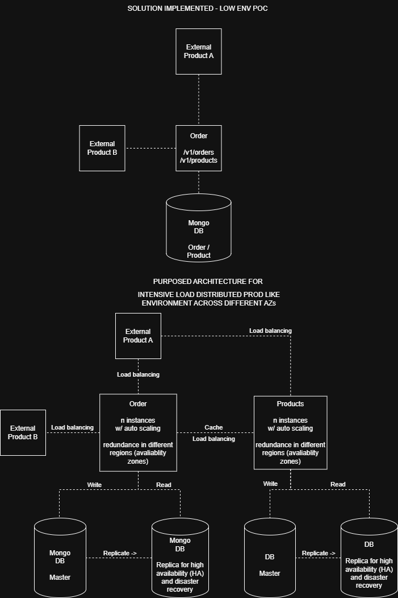

Order
========
Sample Spring boot RESTful API for creating product orders.

It receives a list of products that must exists in the Product Table (or product sub-system) then it calculates the total value of the order, creates and persists the order to a Mongo DB.

It also provides an endpoint for retrieving all the existent orders paginated.

Out of Scope of this exercise - Other CRUD operations for Order or Product.

Maybe will be implemented latter (Keep tuned)

## Getting Started
This project is set using docker and docker compose for lower environment (local testing).

* [Docker download](https://docs.docker.com/get-started/get-docker/)

After installing docker you can start the project as a Java project from your prefered IDE.

#### API Contract
After starting the application check the swagger ui url for contract details.

* [Swagger](http://localhost:8080/swagger-ui/index.html)

### Actuator endpoints
After starting the application you can check the following accessing actuator urls.

* [Health check](http://localhost:8080/actuator/health)
* [Http exchanges](http://localhost:8080/actuator/httpexchanges)

#### Solution design
